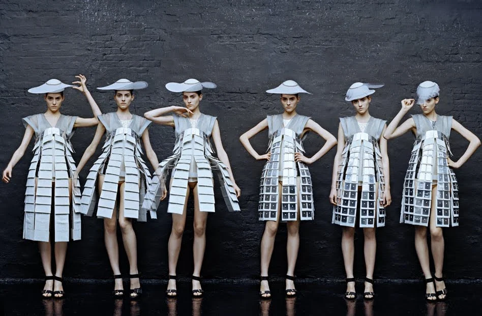

**ALXTIS** // FASHION BEYOND
# AN INTRODUCTION TO CREATIVE COMPUTING WITHIN FASHION 
## INTRODUCTION
The first thing that comes to your mind when thinking of creative computing isn't necessarily fashion, is it? Overall, the subject seems quite dull and not nearly as exciting as a striking new garment strolling down the fasion runway during the latest season. However, this article will completely change your perspective on technology within fashion and is going to open you up to a whole new dimension for you to get lost and mesmerized in. 

#### BUT WHAT EVEN IS CREATIVE COMPUTING?
Unfortunately, a quick Wikipedia search won't give you the answer as it is described quite complicated for someone who is new to the subject. But don't you worry, I am here to break it down for you; it basically refers to the usage of technology within a creative field. However, don't quote me on that! I don't know if that explanation fully covers every aspect of it. Anyway, we are beginners, so my wording will be accurate enough for now. 

#### SOUNDS COMPLICATED! HOW IS THAT EVEN APPLICABLE TO FASHION?
I am glad you asked! In the upcoming few paragraphs, I will give you some examples of technology in fashion. We are mainly going to talk about how technology can be used to be part of the garment itself. Thinking about it, can the model wearing it be classified as a robot? *(Badumtss)*. Anyway, moving on. I am also going to briefly touch upon digital fashion and the metaverse. In the metaverse you can buy clothing that is only present visually but not physically. 
So, buckle up and let us get started: 

## DIGITAL FASHION
Okay, since we are talking about an absolute massive market here, I chose a couple of examples that I personally find quite interesting to look at. First, I want to talk about a designer called **Hussein Chalayan**. Not only because he graduated from Central Saint Martins and I like to brag about how I go to the same University as designers that became famous, but also because he is an absolute prime example of someone who creates wearable technology. He uses a variation of methods to implement technology into his garments, like lights, lasers and crystals, but also puts machinery into his clothing, making them fully transformative. Sidenote: Did you know he worked with Tilda Swinton? Cool, right? I hope my degree will bring me an opportunity like that too! 

Next, let's look at **Ying Gao**, also known as the fashion airbender. She studied fashion design in Switzerland and the central theme of her work is air. Her garments react to air in different kind of ways; one being inflated as soon as the pressure detector in the back of it gets touched, another one unfurls with the breath of the wearer and a final one is animated when approached. Only people having studied in Switzerland can come up with such complex concepts, what a country full of geniuses! Did I mention I grew up in Switzerland and lived there up to my early 20s? 

I would also like to introduce you to **Iris Van Herpen**, the fashion technology goddess herself. She often gets inspired by the most impossible materials to recreate, therefore relying on advanced technology to mimic those materials in some shape or another. For example, one of her dresses looks like water is splashed onto the model's body, how insane is that? She basically reinvented the Niagara Falls with that garment. She also had an instillation in which a dress got directly 3D printed onto the model. All in front of an audience - pure insanity in the best way possible! However, I need to shut op now or otherwise I will never stop blabbing on.

Lastly, we are going to talk about **Auroboros**, a digital fashion brand that creats digital clothing. It all started off as a means of creating high end fashion that wouldn't be as environmentally unfriendly and less overprized. What it means is they are selling a service in which they will edit digital clothing onto a picture of you. At least someone is thinking about the fashion-obsessed CSM students with 30k of depth on their back who want to have an expensive looking Instagram feed. Additionally, they have also started to produce MR filters, meaning that you can download a filter onto your phone that will detect your body and put you into their digital clothing designs. Obviously, the clothing will only appear on your phone screen and not actually in real life. We haven't reached the Matrix just yet, regardless of the fourth movie coming out soon. However, (and apologies for bringing her up in advance), the fashion industry has been moving increasingly into the digital realm and is trying to escape from burning planet earth into the metaverse ever since miss Rona crash landed on earth. The metaverse is basically this alternate dimension in which we can take on another identity. It's quite scary and overly complicated material, but somehow, I am still very addicted to reading about it. 

And here we are, the end of this text. I hope you enjoyed this truly short but exciting trip into creative computing within fashion. Who knows, maybe you've picked up interest in it yourself? Take care and we will see each other in the metaverse. All glammed up of course! 
