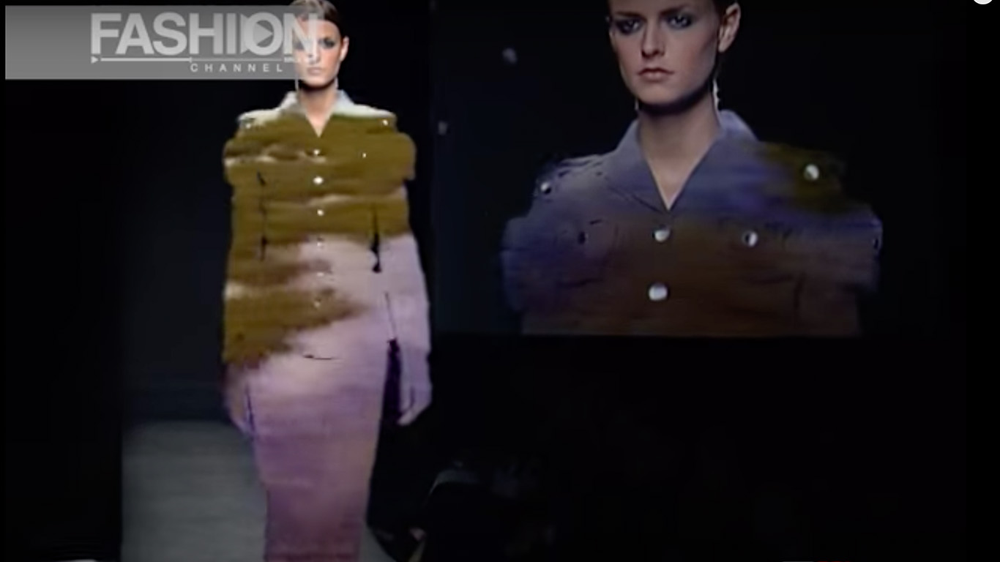
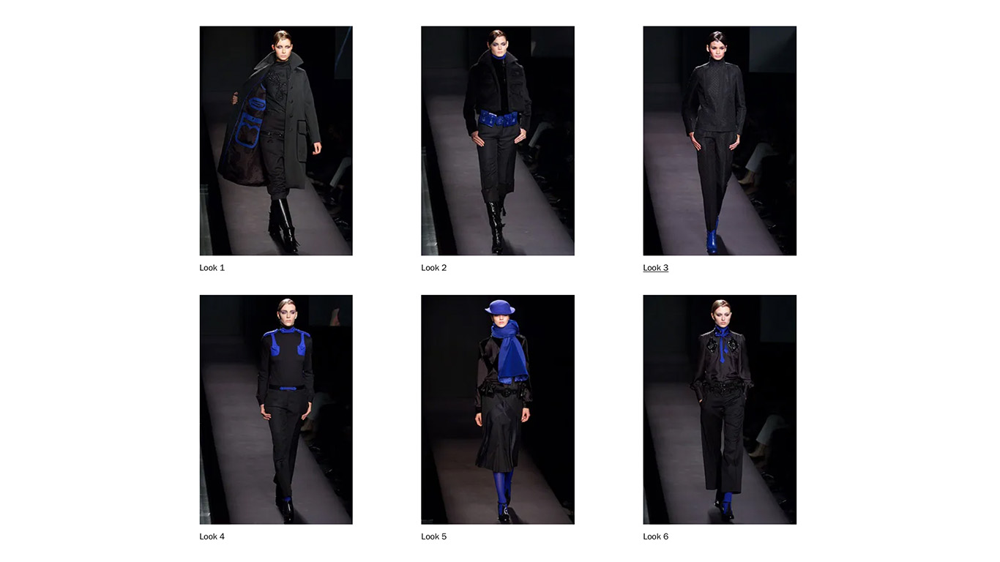
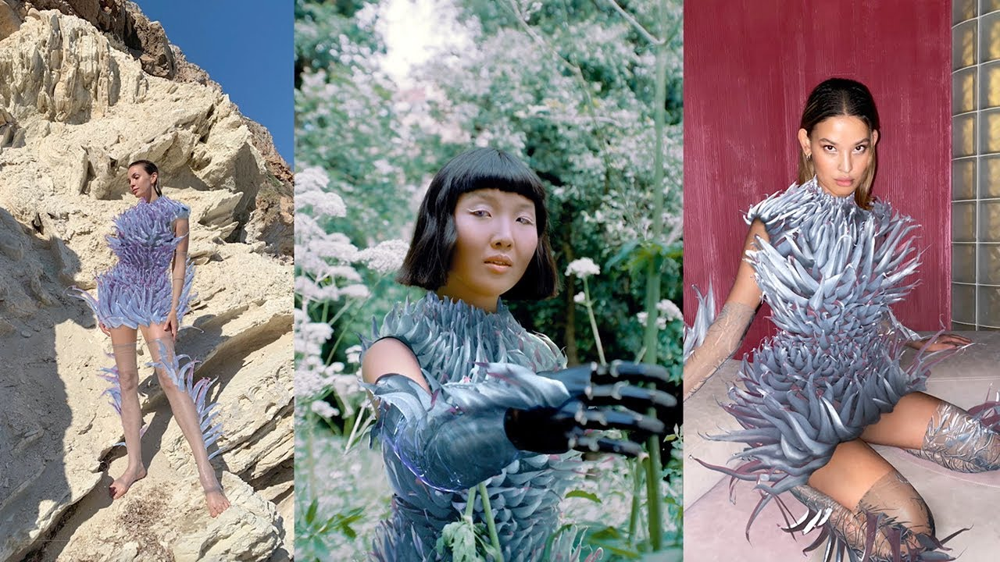

# Unit2
Read.me file for Unit 2.
# CREATIVE COMPUTING WITHIN FASHION

### INITIAL APPROACH

Having been introduced to this brief, I was immediatly concerned about having to deal with yet another project that wouldn't allow me to explore the field I am interested in. However, I quickly decided to get inventive in finding a way on introducing creative computing to the fashion community. Something that immediatly had me hooked during my initial research was the idea of merging digital reality and fashion and the possibilities it could provide.

### VIKTOR & ROLF

During my intial process I came across the designer-duo Viktor & Rolf and their 2002 fashion show "long live the immaterial". The fashion show consisted of all-black outfits with hints of royal blue such as the collar, pockets, belts or patterns. As mesmerasing the cloting was, the intriguing part of the show was the very well thought through backdrop. A live-performance of the show was projected onto the backdrop and the royal blue got replaced by different visuals much like as you would expect when using a greenscreen. The entire show was a discussion on what is and what is not, what remains when you remove and how perceptions can be changed. This reminded me of the countless discussions I had on digital reality and the "illusion" it creates.

### FASHION AND TECHNOLOGY
Another aspect to take into consideration is the use of technology in order to create garments as well as technology directly used within garments as they are worn. The industrialisation has made it possible to come up with new techniques, materials and processes for garment making. A pioneering designer in this field would be Iris van Herpen who constantly challenges herself by taking the most impossible material and turning it into clothing. She heavily relies on technology such as laser cutting, 3D printing and a range of newly explored materials.

### DIGITAL FASHION
As a next step I looked into the art of digital fashion and the insane development it is undergoing right now. The reason why digital fashion is slowly starting to boom is due to its benefits; digital fashion is environmentaly friendly and the prices are a lot more reasonable, therefore making it purchasable for a broader audience. Additionally, due to its digital nature it is possible to animate the clothing. This is opening up a whole new sphere into the exploration of garments and their movement in a certain space.

**AURO BOROS**

### MOVING FORWARD

