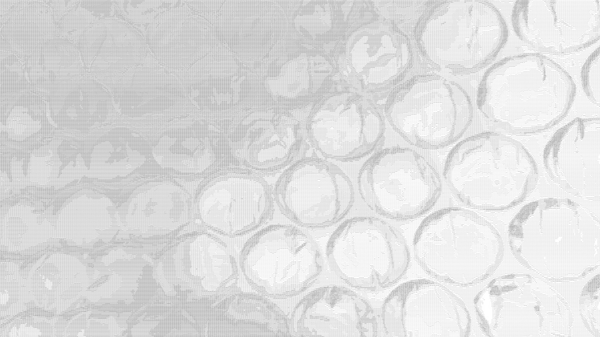
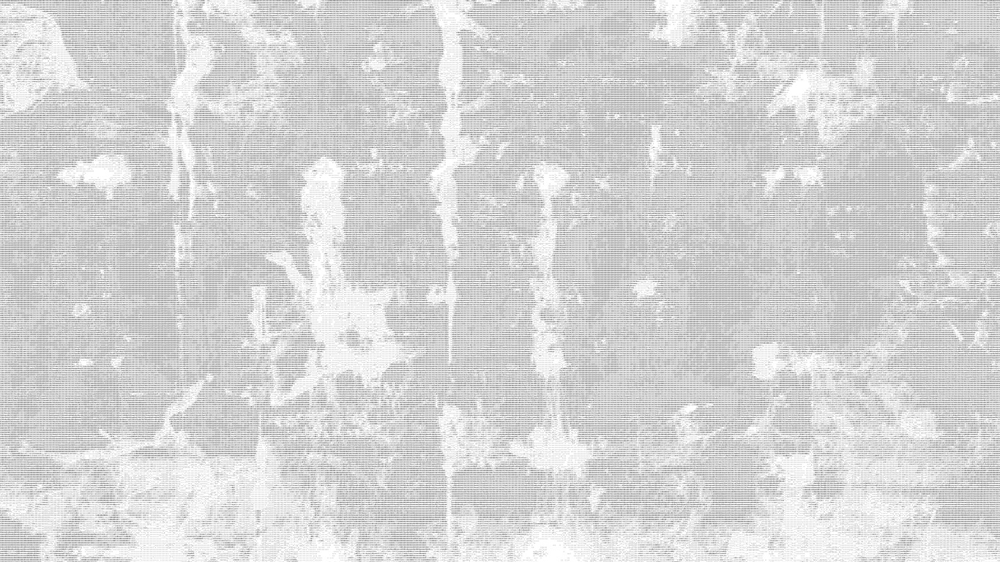

# Unit2
Read.me file for Unit 2.
# ASCII FASHION PROJECTION

## APPROACH

Having been introduced to this brief, I was immediatly concerned about having to deal with yet another project that wouldn't allow me to explore the field I am interested in. However, I quickly decided to get inventive in finding a way on introducing creative computing to fashion. Something that immediatly had me hooked during the presentation on monday was the creation of ASCII (American Standart Code for Information Interchange) art and the textures ASCII generators create. Therefore, I went out and got pictures of as many textures as I possibly could in order to eventually print their ASCII rendering onto fabric.

## RESEARCH

During my intial process I came across the designer duo Viktor & Rolf's and their 2002 fashion show "long live the immaterial". The fashion show consisted of all-black outfits with hints of royal blue such as the collar, pockets, belts or patterns. As mesmerasing the designs were, the real star of the show was the very well thought through backdrop.

